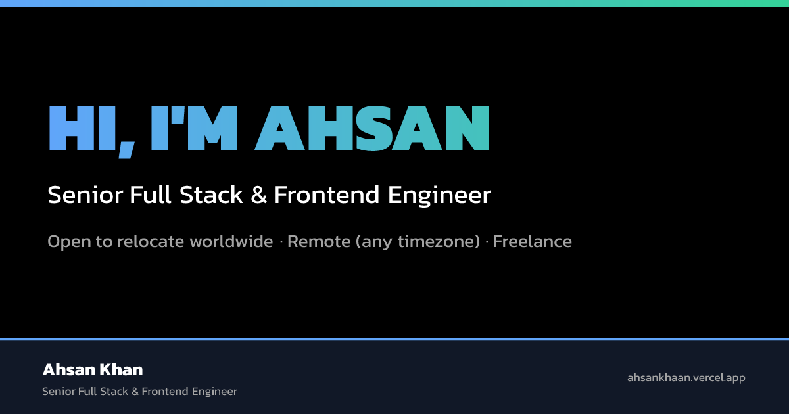

<div align="center">



# Ahsan Khan — Portfolio

Senior Full Stack &amp; Frontend Developer · React · Next.js · TypeScript · Node.js
Open to relocation, remote roles and freelance work.

[**ahsankhaan.vercel.app**](https://ahsankhaan.vercel.app) · [LinkedIn](https://linkedin.com/in/ahsankhaan) · [Hiring? Start here](https://ahsankhaan.vercel.app/for)


</div>

---

## What this is

A personal portfolio built to do real work for a job search — not just a static résumé page. It's a Next.js 15 site with:

- **One brand token file** (`brand/tokens.json`) that drives the website, transactional emails and LinkedIn post images, so a single color change propagates everywhere.
- **A gated CV-delivery system** — the CV is never at a public URL. Requesting it goes through email format + disposable-domain + MX-record checks, then a signed, time-limited download link, not a direct file.
- **A working, validated contact form** sent via Gmail SMTP as the real account, with per-inquiry-type routing (full-time / remote / freelance).
- **AI-search-optimized recruiter content** — a structured FAQ (`FAQPage` schema), an `llms.txt`, and four persona-specific pages (`/for/tech-recruiters`, `/for/remote-hiring`, `/for/relocation-sponsorship`, `/for/talent-acquisition`) using the programmatic-SEO "persona" pattern: genuinely different content per audience, not template variables swapped.
- **Pixel-hardened HTML email templates** (signature, CV delivery, recruiter outreach) built for Outlook/Gmail rendering quirks, not just browser preview.

## Quick start

```bash
npm install
cp .env.example .env.local   # fill in the values below
npm run dev
```

`npm run dev` and `npm run build` both run `npm run brand` first automatically (via `predev`/`prebuild`), which resolves `brand/tokens.json` into `app/brand.css` and the built email templates in `brand/dist/`. Run it by hand any time after editing tokens: `npm run brand`.

### Environment variables

| Variable | Required | Purpose |
|---|---|---|
| `GMAIL_USER` | Yes | The Gmail address emails are sent from — sends via Gmail's own SMTP, authenticated as this account, so `from` is genuinely this address and can reach anyone. |
| `GMAIL_APP_PASSWORD` | Yes | An [App Password](https://myaccount.google.com/apppasswords) for that account (needs 2-Step Verification enabled first) — not the account's normal login password. |
| `CV_ACCESS_SECRET` | Yes (for CV requests) | Signs the time-limited CV download links. Generate with `node -e "console.log(require('crypto').randomBytes(32).toString('hex'))"`. |
| `CONTACT_TO_EMAIL` | No | Where contact-form and CV-request notifications land. Defaults to the email in `brand/profile.json`. |

### Testing the recruiter email locally

The recruiter outreach template (`brand/templates/recruiter-email.html`) has `{{ placeholders }}` meant to be filled per-recipient by a future sender script — there's nothing to click on the live site to preview it filled in. To see it rendered with real sample data in an actual inbox:

```bash
npm run brand
npm run test:recruiter-email
# or with your own values:
npm run test:recruiter-email -- --to=you@example.com --company="Acme" --role="Senior Frontend Engineer" --recruiter="Jamie" --line="Saw your Series B — congrats."
```

This is a standalone `node` script (`scripts/test-recruiter-email.mjs`), not an API route — it only runs when you invoke it locally with your own `GMAIL_USER`/`GMAIL_APP_PASSWORD`, so there's no endpoint on the deployed site that could be used to send email through your account. Unlike a third-party email service's sandbox mode, it can send to any `--to` address, not just your own — because it's authenticated directly with Google as your real account.

**CV attachment source:** the script attaches **`private/cv/AhsanKhan_SrSoftwareEngineer.pdf`** directly (read off disk with `readFileSync`, sent via Nodemailer's `attachments` field) — the same file `GET /api/cv/download` streams for the public, gated flow. It's the only place in this codebase that attaches the CV directly rather than gating it, and it's safe specifically because this script is local and manually run for one named recruiter at a time, never a public endpoint. See `brand/brand-guidelines.md` §7 for the full reasoning.

## Project structure

```
app/
  components/sections/   Page sections (Hero, Services, CaseStudies, RecruiterFAQ, …)
  components/ui/         Shared primitives (FadeIn, Magnet, BrandButtons, Cv* components)
  api/                   contact, cv-request, cv/download route handlers
  for/[slug]/             Persona landing pages (tech-recruiters, remote-hiring, …)
  cv/                     Gated CV request page (linked from email signature)
  brand/social/           LinkedIn post + OG image renderer (next/og)
brand/
  tokens.json             Single source of truth for color/type/spacing
  profile.json             Identity, links, metrics — read by the site AND email templates
  templates/*.html         Email source templates (built → brand/dist/)
  brand-guidelines.md       Full design + email + CV-security documentation
data/
  profile.ts               Site content, typed and pulled from brand/profile.json
  personas.ts               Content for the four /for/* recruiter pages
lib/
  cvToken.ts                HMAC-signed, time-limited CV download tokens
  emailValidation.ts        Format + disposable-domain + MX checks
  rafThrottle.ts             requestAnimationFrame-throttled scroll/mousemove handling
scripts/
  build-brand.mjs           Resolves tokens.json → app/brand.css + brand/dist/*.html
  test-recruiter-email.mjs   Local-only real-send test for the recruiter template
docs/
  PORTFOLIO_PROMPT.md        The build spec this site was implemented from
```

## Architecture notes

- **Brand tokens → everywhere.** `brand/tokens.json` resolves at build time into CSS variables (`app/brand.css`, imported by Tailwind) and inlined hex values in the built email HTML (`brand/dist/`). Change a color once; it updates the site, the email signature, the CV-delivery email, the recruiter email and the LinkedIn image renderer together.
- **CV security.** The PDF lives in `private/cv/`, outside `public/`, so there's no static URL for it. `POST /api/cv-request` validates the email, then emails a signed link; `GET /api/cv/download` verifies the signature and expiry before streaming the file. Full writeup in `brand/brand-guidelines.md` §6a.
- **Performance.** The hero's mouse-follow effect and the screenshot marquee's scroll parallax are both throttled to one update per animation frame (`lib/rafThrottle.ts`) — an earlier unthrottled version was queuing a React re-render on every raw `mousemove`/`scroll` event, which was slow enough to visibly delay click handling elsewhere on the page.

## Full documentation

- **`brand/brand-guidelines.md`** — colors, typography, components, the CV security model, email pixel-perfect checklist, LinkedIn post specs.
- **`docs/PORTFOLIO_PROMPT.md`** — the section-by-section build spec, kept in sync with what's actually implemented.

## Deploy

Connected to [Vercel](https://vercel.com) — pushes to `master` deploy automatically. Set the environment variables above in the Vercel project settings before the first deploy that uses the contact form or CV requests.
